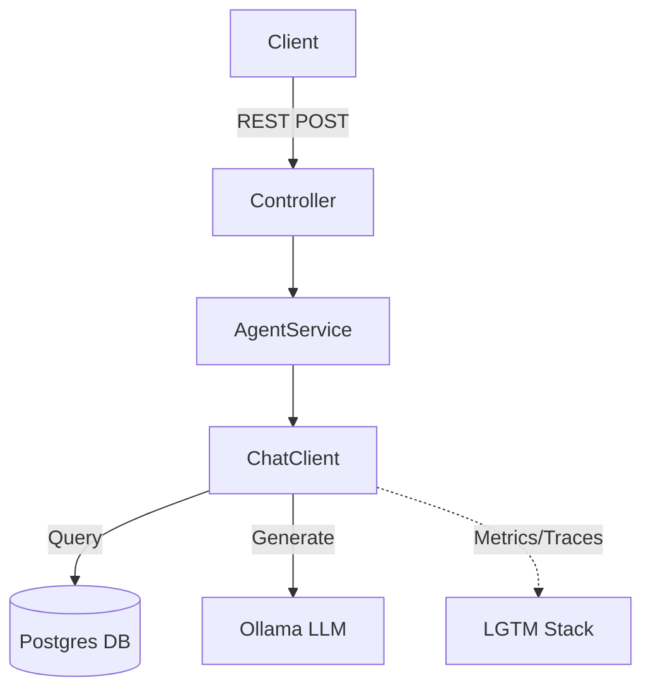

# agent-ollama-springai

A standalone Spring Boot module demonstrating a tool-capable AI agent wired to Ollama, a persistent Postgres datastore for chat memory, and the LGTM observability stack.

## Table of Contents
- [Architecture](#architecture)
- [Key Features](#key-features)
- [Agent & Tool-Calling](#agent--tool-calling)
- [API Reference](#api-reference)
- [Datasource & Chat Memory](#datasource--chat-memory)
- [Configuration Reference](#configuration-reference)
- [Production Readiness](#production-readiness)

## Architecture


## Key Features
- **ReAct-style Reasoning**: Powered by a robust system prompt for tool usage.
- **Persistent Memory**: Chat history is saved in PostgreSQL and survives restarts.
- **Observability**: Metrics and distributed tracing via OpenTelemetry to Grafana/LGTM.

## Agent & Tool-Calling
The agent currently has access to the following tools:
- `currentDateTime`: Returns current date and time.
- `calculator`: Performs basic arithmetic.
- `weatherLookup`: Mock lookup tool for city weather.

## API Reference
Send a chat message using the REST API:
```bash
curl -X POST http://localhost:8080/api/agent/session-123 \
  -H "Content-Type: application/json" \
  -d '{"message":"What time is it and what is 5 * 20?"}'
```

## Datasource & Chat Memory
This module uses a JDBC-backed `MessageWindowChatMemory` repository.
- **Schema Management**: Liquibase manages the `SPRING_AI_CHAT_MEMORY` schema. `spring.ai.chat.memory.repository.jdbc.initialize-schema=never` delegates ownership directly to Liquibase.
- **Persistence Across Restarts**: The memory relies on a durable Postgres volume.

## Configuration Reference

| Property | Default | Description |
| -------- | ------- | ----------- |
| `spring.ai.ollama.base-url` | `http://localhost:11434` | Ollama API endpoint |
| `spring.ai.ollama.chat.options.model` | `llama3.1` | The tool-capable model used |
| `spring.datasource.url` | `jdbc:postgresql://localhost:5432/agent_db` | Postgres connection string |
| `spring.ai.retry.max-attempts` | `3` | AI client retry count |

## Production Readiness
| Feature | Implemented | Rationale |
| ------- | ----------- | --------- |
| **Error Handling** | Yes | Clean 5xx `ProblemDetail` responses via `GlobalExceptionHandler` |
| **Retry (transient)** | Yes | Configured via Spring AI properties |
| **Timeouts** | Yes | Explicit HTTP connect/read timeouts |
| **Tool-call error handling** | Yes | Internal exceptions are caught and returned as strings |
| **Observability** | Yes | Configured with `management.opentelemetry.*` and `ObservedAspect` |
| **Agent State** | Yes | Persistent JDBC/Postgres storage |
| **Rate Limiting** | No | Relies on API gateway in production |
| **Output Moderation** | No | Requires dedicated moderation model/layer |
| **Circuit Breaking** | No | Minimal required; transient retries are sufficient |
