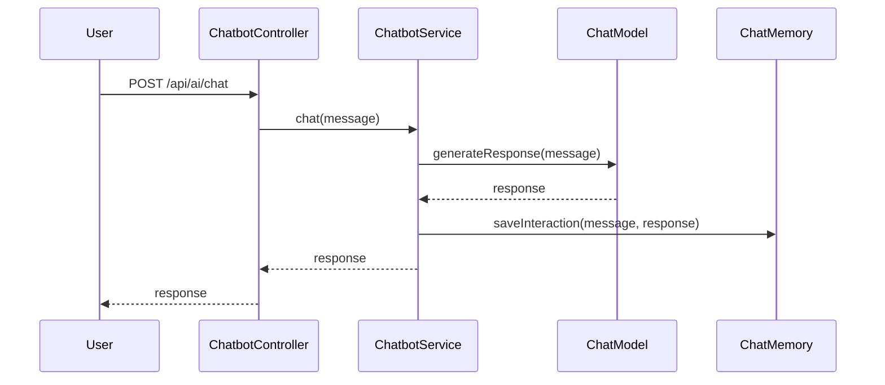
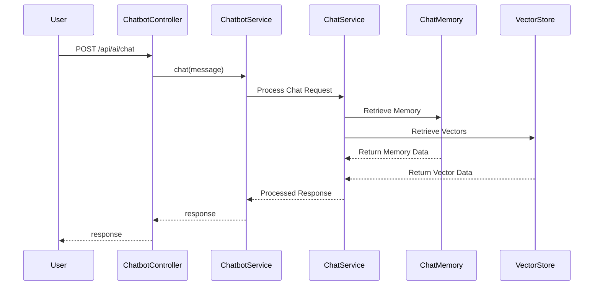

# chatbot-ollama-springai

## Sequence Diagram

Before Vector Store

```mermaid
sequenceDiagram
participant User
participant ChatbotController
participant ChatbotService
participant ChatModel
participant ChatMemory

    User->>ChatbotController: POST /api/ai/chat
    ChatbotController->>ChatbotService: chat(message)
    ChatbotService->>ChatModel: generateResponse(message)
    ChatModel-->>ChatbotService: response
    ChatbotService->>ChatMemory: saveInteraction(message, response)
    ChatbotService-->>ChatbotController: response
    ChatbotController-->>User: response
```

After Vector Store

```mermaid
sequenceDiagram
    participant User
    participant ChatbotController
    participant ChatbotService
    participant ChatService
    participant ChatMemory
    participant VectorStore

    User->>ChatbotController: POST /api/ai/chat
    ChatbotController->>ChatbotService: chat(message)
    ChatbotService->>ChatService: Process Chat Request
    ChatService->>ChatMemory: Retrieve Memory
    ChatService->>VectorStore: Retrieve Vectors
    ChatMemory-->>ChatService: Return Memory Data
    VectorStore-->>ChatService: Return Vector Data
    ChatService-->>ChatbotService: Processed Response
    ChatbotService-->>ChatbotController: response
    ChatbotController-->>User: response
```