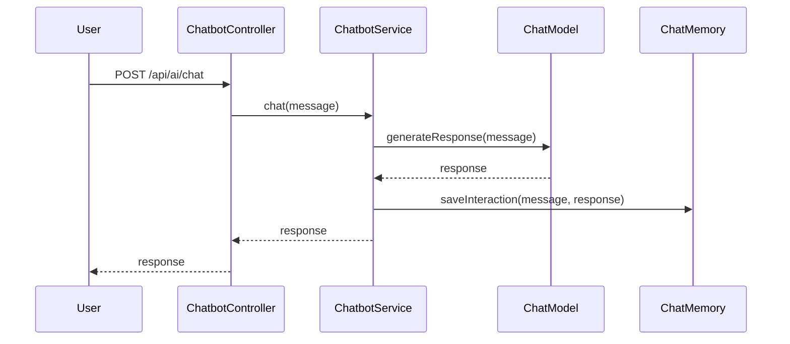

# chatbot-ollama-springai

## Sequence Diagram

```mermaid
sequenceDiagram
participant User
participant ChatbotController
participant ChatbotService
participant ChatModel
participant ChatMemory

    User->>ChatbotController: POST /api/ai/chat
    ChatbotController->>ChatbotService: chat(message)
    ChatbotService->>ChatModel: generateResponse(message)
    ChatModel-->>ChatbotService: response
    ChatbotService->>ChatMemory: saveInteraction(message, response)
    ChatbotService-->>ChatbotController: response
    ChatbotController-->>User: response

```