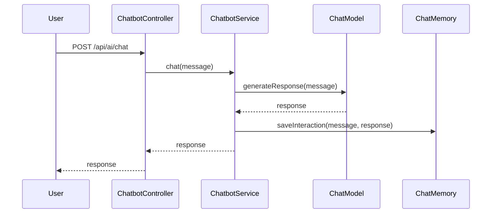
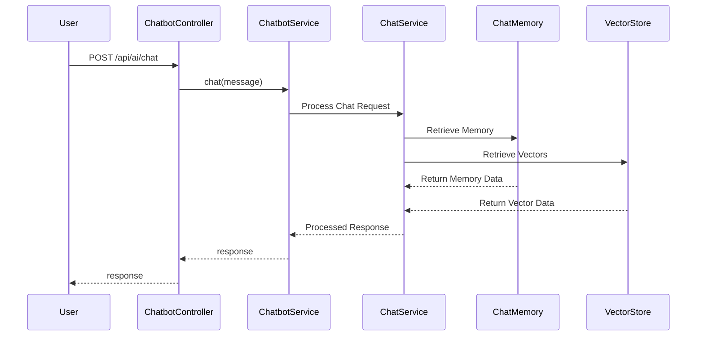

# chatbot-ollama-springai

## Architecture Overview

This module is a Spring Boot 4 demo using Spring AI for conversational chat with:
- Ollama as the model provider
- Redis Stack for Spring AI Redis chat memory (RedisJSON + RediSearch) and Vector Store
- LGTM stack for observability, metrics, and tracing

## Prerequisites

- Java 25+
- Docker and Docker Compose
- Git

## How to Run

1. Start local infrastructure:
   ```bash
   cd chatbot/chatbot-ollama-springai/docker
   docker compose up -d
   ```

2. Start the application:
   ```bash
   cd ../
   ./mvnw spring-boot:run
   ```

3. Run tests (Testcontainers auto-starts required services):
   ```bash
   ./mvnw test
   ```

## Chat Memory

This project now uses Redis Stack for Spring AI chat memory instead of JDBC-based repository.

Redis Stack provides:
- RedisJSON for persisted conversation payloads
- RediSearch for fast chat memory indexing and retrieval

Application properties for chat memory include:
- `spring.ai.chat.memory.redis.host=localhost`
- `spring.ai.chat.memory.redis.port=6379`
- `spring.ai.chat.memory.redis.initialize-schema=true`
- `spring.ai.chat.memory.redis.index-name=chat-memory-index`
- `spring.ai.chat.memory.redis.key-prefix=chat-memory:`
- `spring.ai.chat.memory.redis.time-to-live=24h`

## Vector Store
This project now uses Redis Stack for Spring AI Vector Store instead of PgVector.
- `spring.ai.vectorstore.redis.initialize-schema=true`
- `spring.ai.vectorstore.redis.index=spring-ai-vector-store`

Chat memory entries are configured to expire after 24 hours, and Redis persistence is handled by Redis Stack.

## Observability

This module exposes metrics and tracing for Redis Stack.

LGTM stack endpoints:
- Grafana: `http://localhost:3000`
- Prometheus: `http://localhost:9090`
- OTLP/Tempo: `http://localhost:4318`

Key observability settings:
- `management.metrics.tags.service.name=${spring.application.name}`
- `management.tracing.sampling.probability=1.0`
- `management.opentelemetry.tracing.export.otlp.endpoint=http://localhost:4318/v1/traces`
- `management.opentelemetry.logging.export.otlp.endpoint=http://localhost:4318/v1/logs`
- `spring.ai.vectorstore.observations.log-query-response=true`
- `spring.ai.chat.client.observations.log-completion=true`
- `spring.ai.chat.client.observations.log-prompt=true`

Redis command metrics should be visible in Prometheus and Grafana when Redis Stack is running.

## Sequence Diagram

Before Vector Store



After Vector Store


## Guardrails

To ensure safe and reliable interactions, several guardrails have been implemented:

| Guardrail Type             | Implemented | Rationale                                                                                                           |
|----------------------------|-------------|---------------------------------------------------------------------------------------------------------------------|
| Input Validation           | Yes         | Prevents excessively long inputs and invalid characters using @NotBlank, @Size, and @Pattern on AIChatRequest.      |
| Sensitive Word Filtering   | Yes         | Blocks queries containing inappropriate or out-of-scope words using SafeGuardAdvisor.                               |
| Logging                    | Yes         | Logs prompts and responses via SimpleLoggerAdvisor for auditing.                                                    |
| System Prompt Constraints  | Yes         | Explicitly instructs the LLM to stay on topic and refuse harmful requests via .defaultSystem().                     |
| Rate Limiting              | No          | Requires separate infrastructure (e.g., Redis rate limiter or API Gateway) which adds complexity to this demo.      |
| Output Moderation          | No          | Too complex/slow for this basic demonstration, and relies on the LLM's inherent safety training.                    |
| Prompt Injection Detection | No          | Advanced prompt injection detection is often handled by specialized commercial APIs rather than simple local logic. |

### Configuration Examples

Configure guardrails in application.properties:
``properties
guardrails.sensitive-words=politics,religion,violence,hate speech,explicit content
guardrails.failure-message=I'm sorry, but I cannot assist with that topic. Please ask a question related to customer support.
guardrails.logging.enabled=true
``
