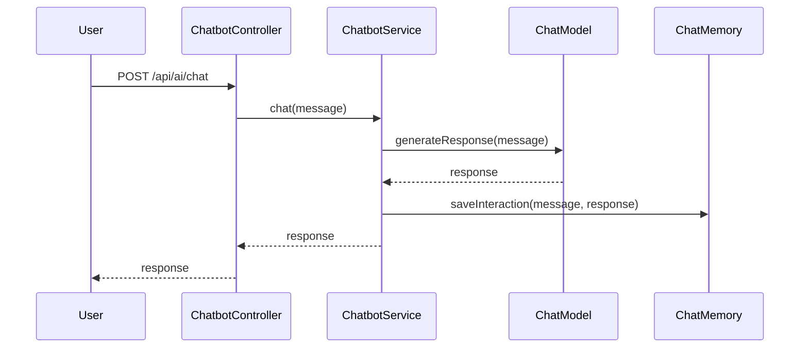
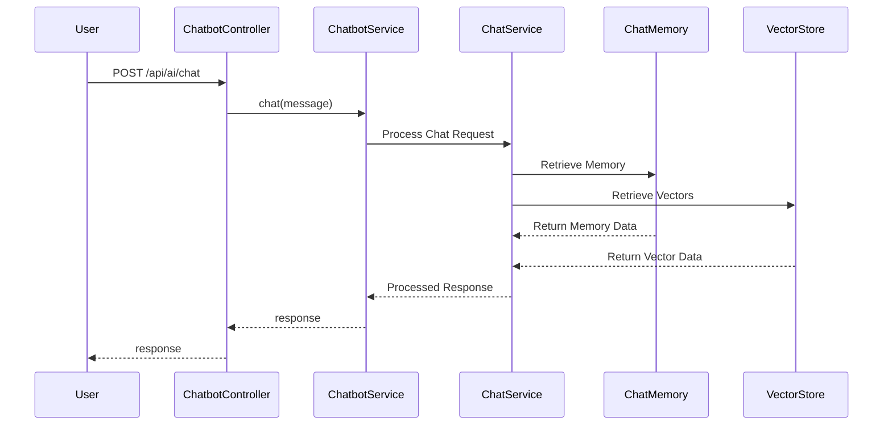

# chatbot-ollama-springai

## Architecture Overview

This module is a Spring Boot 4 demo using Spring AI for conversational chat with:
- Ollama as the model provider
- Redis Stack for Spring AI Redis chat memory (RedisJSON + RediSearch)
- PgVector for the vector store
- LGTM stack for observability, metrics, and tracing

## Prerequisites

- Java 25+
- Docker and Docker Compose
- Git

## How to Run

1. Start local infrastructure:
   ```bash
   cd chatbot/chatbot-ollama-springai/docker
   docker compose up -d
   ```

2. Start the application:
   ```bash
   cd ../
   ./mvnw spring-boot:run
   ```

3. Run tests (Testcontainers auto-starts required services):
   ```bash
   ./mvnw test
   ```

## Chat Memory

This project now uses Redis Stack for Spring AI chat memory instead of JDBC-based repository.

Redis Stack provides:
- RedisJSON for persisted conversation payloads
- RediSearch for fast chat memory indexing and retrieval

Application properties for chat memory include:
- `spring.data.redis.host=localhost`
- `spring.data.redis.port=6379`
- `spring.ai.chat.memory.redis.initialize-schema=true`
- `spring.ai.chat.memory.redis.index-name=chat-memory-index`
- `spring.ai.chat.memory.redis.key-prefix=chat-memory:`
- `spring.ai.chat.memory.redis.time-to-live=24h`

Chat memory entries are configured to expire after 24 hours, and Redis persistence is handled by Redis Stack.

## Observability

This module exposes metrics and tracing for both Redis and PostgreSQL.

LGTM stack endpoints:
- Grafana: `http://localhost:3000`
- Prometheus: `http://localhost:9090`
- OTLP/Tempo: `http://localhost:4318`

Key observability settings:
- `management.metrics.tags.service.name=${spring.application.name}`
- `management.tracing.sampling.probability=1.0`
- `management.opentelemetry.tracing.export.otlp.endpoint=http://localhost:4318/v1/traces`
- `management.opentelemetry.logging.export.otlp.endpoint=http://localhost:4318/v1/logs`
- `spring.ai.vectorstore.observations.log-query-response=true`
- `spring.ai.chat.client.observations.log-completion=true`
- `spring.ai.chat.client.observations.log-prompt=true`

Redis command metrics should be visible in Prometheus and Grafana when Redis Stack is running. PostgreSQL JDBC metrics, query latency, and connection pool stats continue to be captured via the existing datasource observability configuration.

## Sequence Diagram

Before Vector Store



After Vector Store

