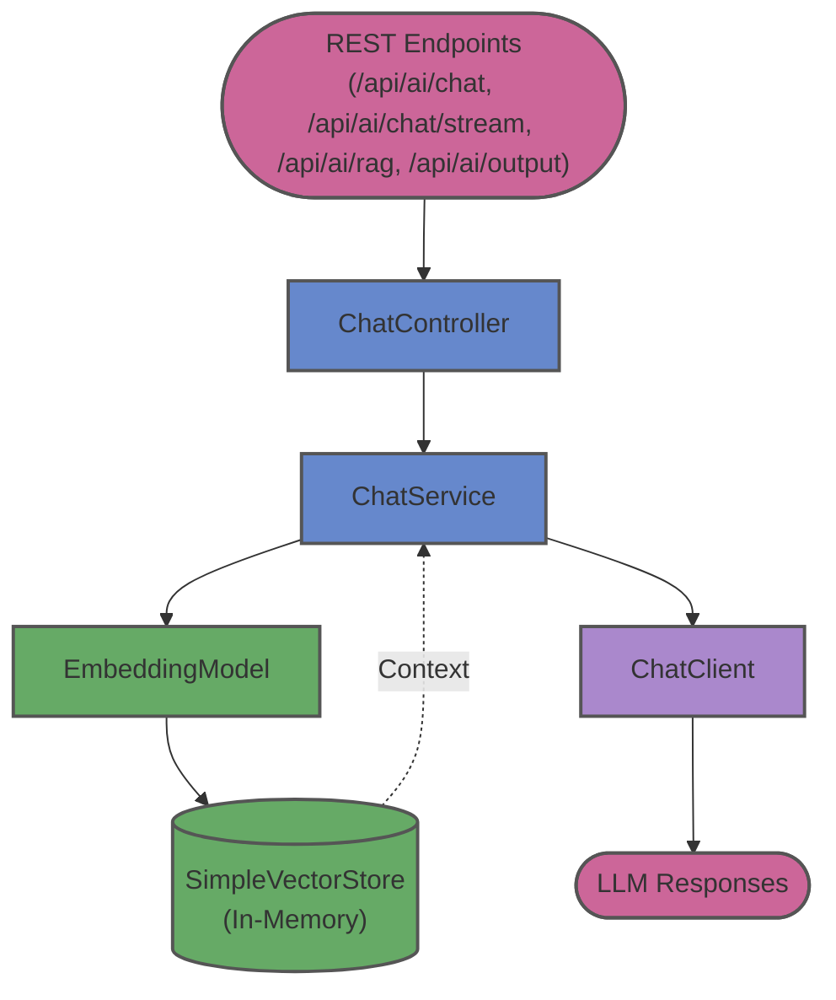

# chatmodel-springai

This module showcases various chat interaction modes using the Spring AI framework. It exposes multiple REST endpoints to demonstrate plain text generation, prompt templating, streaming responses, and simple in-memory Retrieval-Augmented Generation (RAG).

## Endpoints
- `/api/ai/chat`: Basic text-in, text-out interaction.
- `/api/ai/chat/stream`: Streams the LLM response back to the client using Server-Sent Events (SSE).
- `/api/ai/rag`: A simple in-memory RAG implementation using a local vector store.
- `/api/ai/output`: Demonstrates structured output parsing from the LLM.

## Architecture

