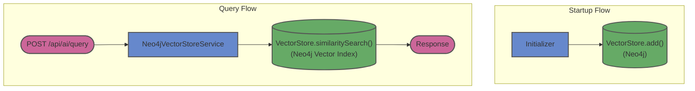

# neo4j-springai

## Architecture



### Run tests

```shell
./mvnw clean verify
```

### Run locally

```shell
docker-compose -f docker/docker-compose.yml up -d
./mvnw spring-boot:run -Dspring-boot.run.profiles=local
```
### Using Testcontainers at Development Time
You can run `TestApplication.java` from your IDE directly.
You can also run the application using Maven as follows:

```shell
./mvnw spotless:apply spring-boot:test-run
```

### Useful Links
* Swagger UI: http://localhost:8080/swagger-ui.html
* Actuator Endpoint: http://localhost:8080/actuator
