# opensearch-langchain4j

This module demonstrates a standalone, lightweight integration (no Spring Boot) between LangChain4j and OpenSearch for vector embeddings. It highlights a batch ingestion pattern, reading documents from `restaurants.json`, embedding them locally using `AllMiniLmL6V2`, and bulk loading them into OpenSearch.

## Architecture

```mermaid
flowchart TD
    %% Define Styles / Legend
    classDef userReq fill:#cc6699,stroke:#555555,stroke-width:2px;
    classDef coordinator fill:#6688cc,stroke:#555555,stroke-width:2px;
    classDef searchEngine fill:#66aa66,stroke:#555555,stroke-width:2px;
    classDef llm fill:#aa88cc,stroke:#555555,stroke-width:2px;

    subgraph IngestionFlow ["Ingestion Flow (Batch Mode)"]
        MainIngest["main()"]:::coordinator
        Source["restaurants.json"]:::userReq
        EmbedIngest["AllMiniLmL6V2<br/>(Embed)"]:::llm
        AddStore[("OpenSearchEmbeddingStore.add()")]:::searchEngine
        
        MainIngest --> Source
        Source --> EmbedIngest
        EmbedIngest --> AddStore
    end

    subgraph QueryFlow ["Query Flow"]
        QueryMode(["Query Mode"]):::userReq
        EmbedQuery["AllMiniLmL6V2<br/>(Embed)"]:::llm
        SearchStore[("OpenSearchEmbeddingStore.search()")]:::searchEngine
        Results(["Results"]):::userReq
        
        QueryMode --> EmbedQuery
        EmbedQuery --> SearchStore
        SearchStore --> Results
    end
```

*** Links

http://localhost:9200/default/_search

Reference :
 - https://github.com/langchain4j/langchain4j-examples/tree/main/opensearch-example
