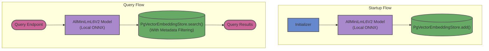

# pgvector-langchain4j

This module demonstrates vector embedding and retrieval using LangChain4j and a PostgreSQL database extended with `pgvector`. A key highlight of this implementation is the use of a local ONNX embedding model (`AllMiniLmL6V2`) running directly in the JVM, and the ability to perform metadata filtering during searches.

## Architecture

