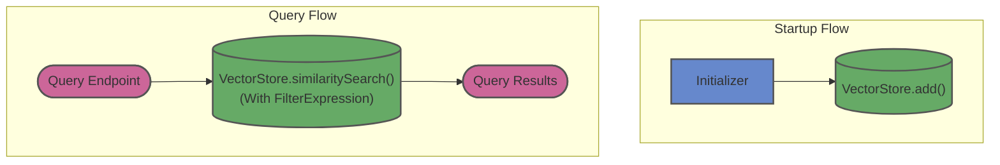

# pgvector-springai

This module demonstrates vector similarity search using Spring AI's robust abstraction layer over `pgvector`. Contrasting with the LangChain4j approach, this module leverages Spring Boot autoconfiguration and Spring AI's standardized `VectorStore` interface, making it easy to swap underlying vector databases with minimal code changes.

## Architecture

