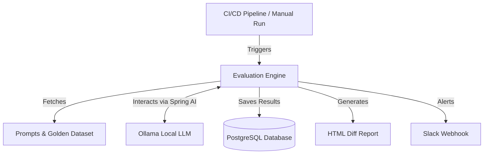
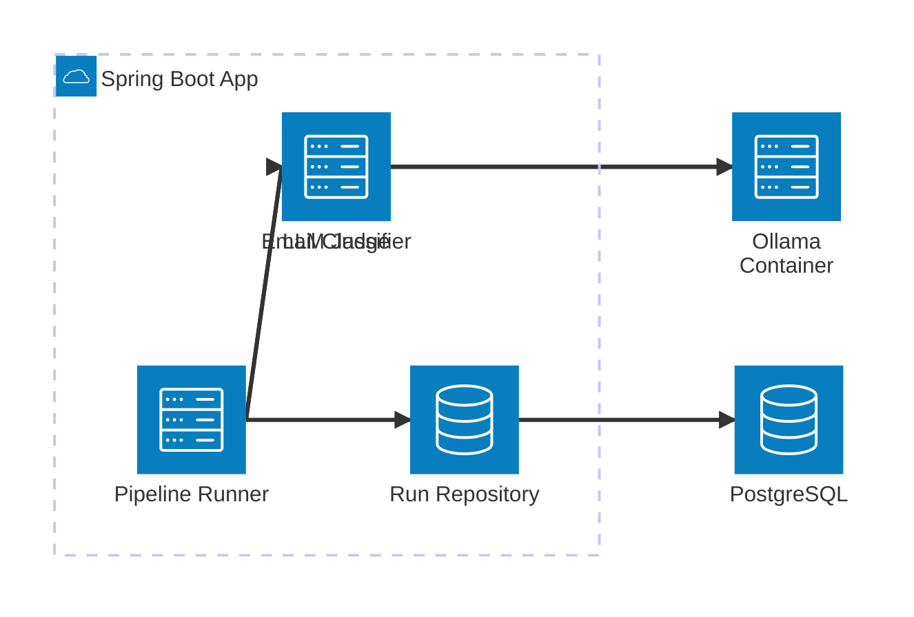
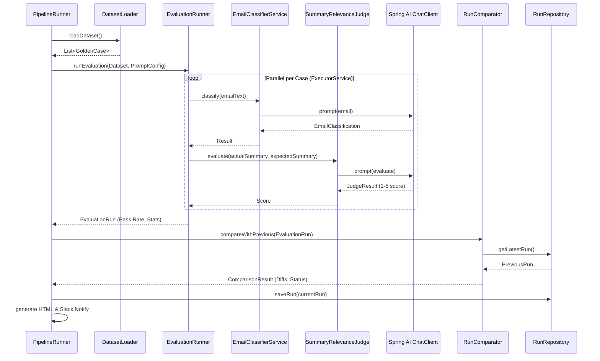

# Model Regression Detection

A Spring Boot module for detecting regressions in LLM outputs.

## High Level Design (HLD)
This diagram shows the system from a bird's-eye view. It explains how different external triggers and systems interact with the Model Regression Detection framework.

## Architecture Diagram
This diagram outlines the major components, boundaries, and technologies used within the module.

*Note: The module uses Spring AI to interface with the Ollama model and Spring JDBC to persist run metadata to PostgreSQL.*

## Low Level Design (LLD)
This diagram details the sequence of internal classes and how they collaborate to evaluate a single regression run.

## Configuration Reference

| Property | Description | Default |
|---|---|---|
| `eval.thresholds.warning-delta-percent` | Warning threshold for pass rate drop | 3.0 |
| `eval.thresholds.critical-delta-percent` | Critical threshold for pass rate drop | 8.0 |
| `eval.thresholds.drift-threshold` | 7-run moving average pass rate threshold | 85.0 |

## Adding Golden Cases
Add cases to `src/main/resources/golden-dataset.json`. Ensure diverse examples, especially edge cases.

## Adjusting Thresholds
Change the threshold properties in `application.properties` or environment variables to tune sensitivity.

## Architecture Decisions
- **PostgreSQL over SQLite**: Standardized on Postgres via PGvector to align with other repo modules.
- **Async Execution**: Used CompletableFuture with bounded thread pool to accelerate the evaluation process.
- **LLM-as-a-judge**: Used a low temperature LLM client to score summaries since exact-matching summaries is fragile.
