# java-openai

This module demonstrates a raw, low-level HTTP client integration with the OpenAI API using standard Java libraries. It serves as an educational baseline for understanding how LLM communication works under the hood before moving to higher-level frameworks like LangChain4j or Spring AI.

## Architecture

```mermaid
flowchart LR
    %% Define Styles / Legend
    classDef userReq fill:#cc6699,stroke:#555555,stroke-width:2px;
    classDef coordinator fill:#6688cc,stroke:#555555,stroke-width:2px;
    classDef processing fill:#cc8855,stroke:#555555,stroke-width:2px;
    classDef llm fill:#aa88cc,stroke:#555555,stroke-width:2px;

    Main(["Main"]):::userReq
    Req["ChatRequest / Message"]:::processing
    Http["HttpClient POST"]:::coordinator
    OpenAI["OpenAI API"]:::llm
    Res["ChatResponse"]:::processing
    Output(["Parsed Output"]):::userReq

    Main --> Req
    Req --> Http
    Http -->|Network Call| OpenAI
    OpenAI -->|JSON Body| Res
    Res --> Output
```

