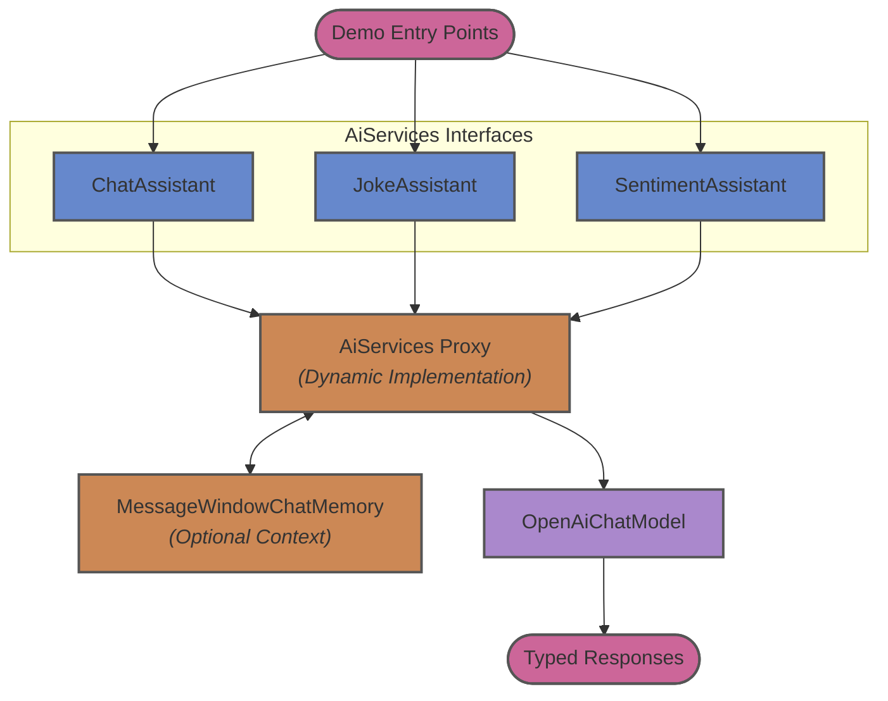

# playground-langchain4j

This module serves as an exploratory playground for LangChain4j. It demonstrates how to utilize powerful concepts like `AiServices` to declaratively define AI behavior through Java interfaces, and how to maintain conversational context using chat memory.

## Architecture

