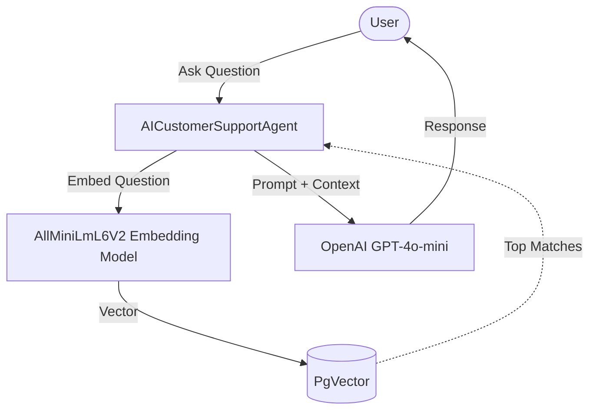

# llm-rag-with-langchain4j-spring-boot

## Architecture
The application uses a Retrieval-Augmented Generation (RAG) pipeline to enhance LLM responses with local knowledge.

## Configuration

### Document Chunking Strategy
We use `DocumentSplitters.recursive` which is configured in `application.properties`:
- `langchain4j.rag.chunking.size=300`: Defines the maximum number of characters/tokens per chunk.
- `langchain4j.rag.chunking.overlap=50`: Overlaps chunks to prevent cutting off context at chunk boundaries.

### Retrieval Configuration
- `langchain4j.rag.retrieval.maxResults=3`: Retrieves the top 3 segments from the vector store.
- `langchain4j.rag.retrieval.minScore=0.6`: Filters out low-quality matches below the 0.6 similarity score threshold.

### Observability Setup
The pipeline includes multiple layers of observability:
1. **Actuator & Micrometer:** Health checks for the PgVector store and Micrometer counters (`llm.requests`, `llm.responses`, `llm.errors`).
2. **ChatModelListener:** Intercepts requests, responses, and errors from the LLM, outputting structured logs.
3. **Structured Logging:** Timings and match scores for vector search operations are logged for debugging.

### Diagnostic Output
You can enable retrieval diagnostics (viewing the raw returned segments and their similarity scores) by appending `?includeDiagnostics=true` to your API request.
The response will include a `diagnostics` array:
- **`text`**: The raw chunk of text retrieved.
- **`score`**: The similarity score (1.0 is a perfect match, 0.0 is no relation). Scores above `minScore` (0.6) are processed by the LLM.

### Links
- PGAdmin http://localhost:5050

### Reference
- https://github.com/langchain4j/langchain4j-examples/tree/main/spring-boot-example
