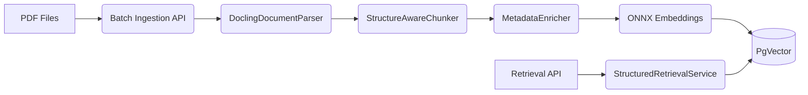

# RAG Langchain4j with Docling

This project is a comprehensive Document Ingestion and Structured Retrieval system.
It leverages LangChain4j, Docling (for advanced layout-aware PDF parsing), PgVector, and ONNX local embeddings (AllMiniLmL6V2).

## Architecture


## Components
- **Docling**: Parses PDFs into structured Markdown, retaining table boundaries and heading hierarchy.
- **PgVector**: PostgreSQL extension for storing embeddings and performing vector similarity search.
- **ONNX Model**: `AllMiniLmL6V2` generates 384-dimensional embeddings locally.

## Configuration Reference
| Property | Default | Description |
|---|---|---|
| `docling.server.url` | `http://localhost:5001` | URL for the `docling-serve` container |
| `langchain4j.rag.chunking.size` | `300` | Max characters per text chunk |
| `langchain4j.rag.chunking.overlap` | `50` | Overlap characters between chunks |
| `ingestion.parallelism` | `4` | Concurrency for batch ingestion |
| `spring.threads.virtual.enabled` | `true` | Use Java virtual threads |

## API Examples

### Batch Ingestion
```bash
curl -X POST "http://localhost:8080/api/ingest/batch" -F "files=@document.pdf"
```

### Retrieval
```bash
curl -X POST "http://localhost:8080/api/retrieve" \
     -H "Content-Type: application/json" \
     -d '{"query": "What is the revenue?", "hasTable": true}'
```

### Benchmarks
```bash
curl "http://localhost:8080/api/benchmark/results"
```
