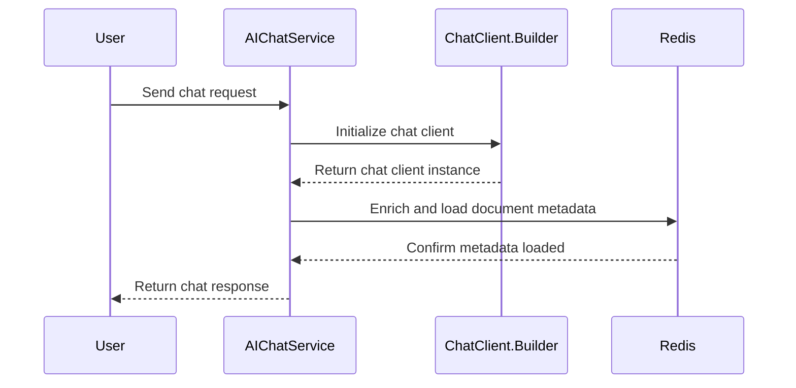

# Getting Started

The use of the pgvector store with the ollama model is not feasible due to the generation of 4096 dimensions by the latter, which exceeds pg vector's indexing support limit of less than 2000 dimensions. This limitation hinders the ease of querying the embedding store due to the absence of indexing.

As LLMs need heavy computational power, they need GPU to be enabled for quick processing using complex Math operations behind the scenes.

## Sequence Diagram

### Testcontainers support

This project uses [Testcontainers at development time](https://docs.spring.io/spring-boot/docs/3.2.4/reference/html/features.html#features.testing.testcontainers.at-development-time).

Testcontainers has been configured to use the following Docker images:

* [`pgvector/pgvector:pg16`](https://hub.docker.com/r/pgvector/pgvector)

Please review the tags of the used images and set them to the same as you're running in production.
