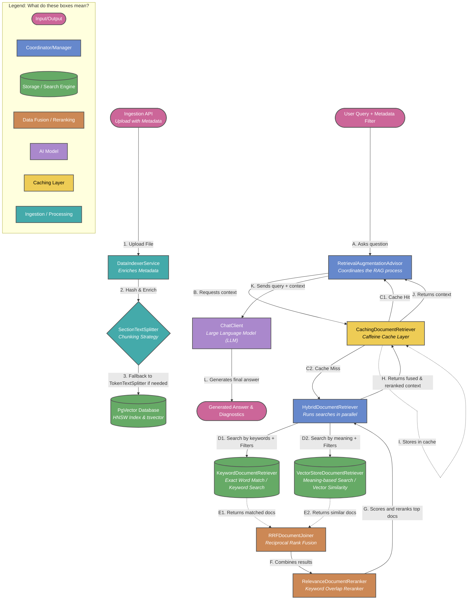

# 🤖 RAG Spring AI Ollama LLM

Welcome to the **RAG (Retrieval-Augmented Generation)** application! This project uses **Spring AI**, **Ollama** (for local LLMs), and **PostgreSQL (pgvector)** to intelligently read your documents and answer questions based on them.

---

## 📑 Table of Contents
1. [Overview](#-overview)
2. [Architecture Flow](`#architecture-flow`)
3. [Key Features](`#-key-features`)
4. [Example API Usage](`#-example-api-usage`)
5. [Configuration & Tuning](`#configuration--tuning`)
6. [Observability & Guardrails](`#observability--guardrails`)
7. [Alternative Approaches](#-alternative-approaches)

---

## 🌟 Overview

When you ask a generic AI a specific question about your private data, it often doesn't know the answer. This project solves that by **RAG**. 
1. **Ingestion**: You upload your private documents. The system chops them into bite-sized pieces and saves them in a database.
2. **Retrieval**: When you ask a question, the system searches the database for the most relevant pieces of information.
3. **Generation**: It hands those pieces to the AI (Ollama) and says, "Answer the user's question using *only* this information."

---

## 🏗️ Architecture Flow

Here is how data flows through the system, from uploading a document to receiving an AI-generated answer.


```mermaid
flowchart TD
    %% Define Styles / Legend
    classDef userReq fill:#cc6699,stroke:#555555,stroke-width:2px,color:#fff;
    classDef coordinator fill:#6688cc,stroke:#555555,stroke-width:2px,color:#fff;
    classDef searchEngine fill:#66aa66,stroke:#555555,stroke-width:2px,color:#fff;
    classDef fusion fill:#cc8855,stroke:#555555,stroke-width:2px,color:#fff;
    classDef llm fill:#aa88cc,stroke:#555555,stroke-width:2px,color:#fff;
    classDef cache fill:#eecc55,stroke:#555555,stroke-width:2px,color:#000;
    classDef ingestion fill:#44aaaa,stroke:#555555,stroke-width:2px,color:#fff;

    %% Nodes for Ingestion
    IngestApi(["Ingestion API<br/><i>Upload with Metadata</i>"]):::userReq
    DataIndexer["DataIndexerService<br/><i>Enriches Metadata</i>"]:::ingestion
    Splitter{"SectionTextSplitter<br/><i>Chunking Strategy</i>"}:::ingestion
    DB[("PgVector Database<br/><i>HNSW Index & tsvector</i>")]:::searchEngine

    %% Nodes for Retrieval
    User(["User Query + Metadata Filter"]):::userReq
    Advisor["RetrievalAugmentationAdvisor<br/><i>Coordinates the RAG process</i>"]:::coordinator
    Cache["CachingDocumentRetriever<br/><i>Caffeine Cache Layer</i>"]:::cache
    HybridRetriever["HybridDocumentRetriever<br/><i>Runs searches in parallel</i>"]:::coordinator
    
    KeywordSearch[("KeywordDocumentRetriever<br/><i>Exact Word Match / Keyword Search</i>")]:::searchEngine
    VectorSearch[("VectorStoreDocumentRetriever<br/><i>Meaning-based Search / Vector Similarity</i>")]:::searchEngine
    
    Joiner["RRFDocumentJoiner<br/><i>Reciprocal Rank Fusion</i>"]:::fusion
    Reranker["RelevanceDocumentReranker<br/><i>Keyword Overlap Reranker</i>"]:::fusion
    
    Ollama["ChatClient<br/><i>Large Language Model (LLM)</i>"]:::llm
    Response(["Generated Answer & Diagnostics"]):::userReq

    %% Ingestion Flow
    IngestApi -->|1. Upload File| DataIndexer
    DataIndexer -->|2. Hash & Enrich| Splitter
    Splitter -->|3. Fallback to TokenTextSplitter if needed| DB
    
    %% Retrieval Flow
    User -->|A. Asks question| Advisor
    Advisor -->|B. Requests context| Cache
    
    Cache -- C1. Cache Hit --> Advisor
    Cache -->|C2. Cache Miss| HybridRetriever
    
    HybridRetriever -->|D1. Search by keywords + Filters| KeywordSearch
    HybridRetriever -->|D2. Search by meaning + Filters| VectorSearch
    
    KeywordSearch -.->|E1. Returns matched docs| Joiner
    VectorSearch -.->|E2. Returns similar docs| Joiner
    
    Joiner -->|F. Combines results| Reranker
    Reranker -->|G. Scores and reranks top docs| HybridRetriever
    HybridRetriever -->|H. Returns fused & reranked context| Cache
    Cache -.->|I. Stores in cache| Cache
    Cache -->|J. Returns context| Advisor
    
    Advisor -->|K. Sends query + context| Ollama
    Ollama -->|L. Generates final answer| Response

    %% Legend
    subgraph Legend [Legend: What do these boxes mean?]
        L1(["Input/Output"]):::userReq
        L2["Coordinator/Manager"]:::coordinator
        L3[("Storage / Search Engine")]:::searchEngine
        L4["Data Fusion / Reranking"]:::fusion
        L5["AI Model"]:::llm
        L6["Caching Layer"]:::cache
        L7["Ingestion / Processing"]:::ingestion
    end
```

---

## ✨ Key Features

1. **Hybrid Search**: Combines two types of search: 
   - **Vector Search** (understands the *meaning* of your question).
   - **Keyword Search** (finds exact words, like error codes).
2. **Section-Aware Chunking**: Intelligently splits your documents by paragraphs or headers rather than just blindly cutting them off mid-sentence.
3. **Metadata Filtering**: You can tag uploaded documents (e.g., `category=hardware`) and then tell the AI to *only* search within that category.
4. **Multi-Stage Retrieval (Reranking)**: The system grabs a bunch of relevant documents, then double-checks and re-scores them to guarantee the absolute best matches go to the AI.
5. **Caching Layer**: If two users ask the exact same question, the system remembers the retrieved documents from the first time, skipping the heavy database search and making the response lightning fast.
6. **HNSW Indexing**: Uses a highly optimized indexing algorithm in PostgreSQL so searches remain instant even with millions of documents.

---

## 🚀 Example API Usage

Interact with the application using standard HTTP requests:

**1. Ingestion (Upload a Document):**
```bash
curl -X POST -F "file=@manual.pdf" \
  "http://localhost:8080/api/ai/upload?documentType=manual&owner=support&category=hardware"
```

**2. Chat (Ask a Question with Filters):**
```bash
curl -X POST http://localhost:8080/api/ai/chat \
  -H "Content-Type: application/json" \
  -d '{
    "question": "How to reboot the server?",
    "documentType": "manual",
    "category": "hardware"
  }'
```

**3. Clear Cache:**
```bash
curl -X DELETE http://localhost:8080/api/data/ai/cache
```

---

## ⚙️ Configuration & Tuning

### Performance Tuning
- **HNSW:** Increase `m` (e.g. 16 to 32) and `ef_construction` (e.g. 64 to 128) if the AI isn't finding the right documents, but this increases RAM usage and build time.
- **Caching:** Modify `rag.cache.ttl-seconds` based on data volatility. Increase `rag.cache.max-size` if you have ample memory and highly repetitive queries.

### Document Chunking Strategy
We use `TokenTextSplitter` configured via properties:
- `rag.chunking.size=300`: Sets the maximum chunk size constraints.
- `rag.chunking.minSize=100`: Maintains a minimum chunk size to preserve context boundaries.
*Note: While models support large context, chunks between 300-500 tokens generally yield the highest quality semantic retrieval.*

---

## 🛡️ Observability & Guardrails

### Observability Setup
This module is fully equipped for production observability:
- **Micrometer Metrics:** Track custom timers (`rag.retrieval.latency`, `rag.ingestion.latency`) and counters (`rag.llm.calls`, `rag.documents.retrieved`) via Grafana.
- **Diagnostics API:** Append `?includeDiagnostics=true` to any chat request to view the raw retrieved text chunks and their precise vector similarity scores!

### Guardrails Configuration
To ensure safe interactions, several guardrails are implemented to intercept bad queries *before* executing expensive AI calls.

Configure guardrails in `application.properties`:
```properties
guardrails.sensitive-words=politics,religion,violence,hate speech,explicit content
guardrails.failure-message=I'm sorry, but I cannot assist with that topic.
guardrails.logging.enabled=true
```

---

## 🧠 Alternative Approaches

While our **Reciprocal Rank Fusion (RRF)** approach is excellent for combining search results, here are other architectures you might consider:

1. **SQL-Level Hybrid Fusion:** Write a single, complex PostgreSQL query that calculates both vector distance and keyword text-match score. Great for pagination, but harder to tune.
2. **LLM-Based Re-ranking:** Pass all candidate documents back into an AI (Cross-Encoder) to accurately score relevance. Extremely accurate but very slow and computationally expensive.
3. **External Re-ranking Services:** Use an API like Cohere Rerank. Very fast and accurate, but introduces a dependency on an external vendor.
4. **Pure BM25 / Keyword-Only Retrieval:** Rely entirely on traditional text search. Extremely fast, but cannot understand synonyms or the "meaning" of a query.
