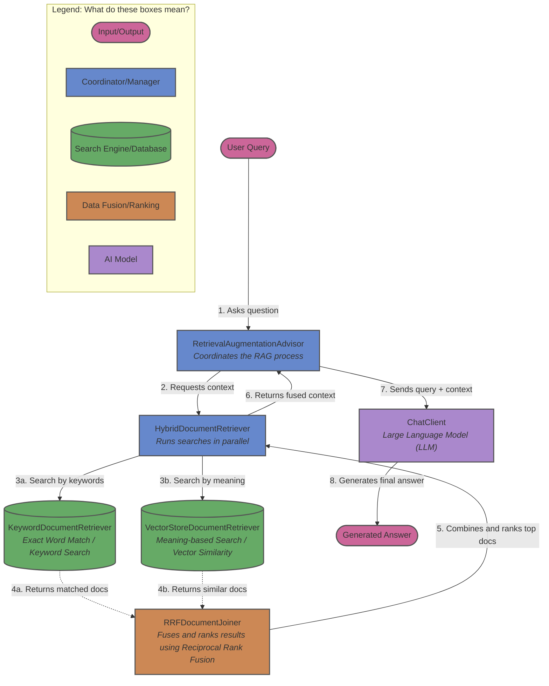

# llm-rag-with-spring-ai-ollama

This project implements a Retrieval-Augmented Generation (RAG) architecture using Spring AI 2.x components, PgVector, and Ollama.

## Architecture & Sequence Flow

```mermaid
flowchart TD
    %% Define Styles / Legend
    classDef userReq fill:#cc6699,stroke:#555555,stroke-width:2px;
    classDef coordinator fill:#6688cc,stroke:#555555,stroke-width:2px;
    classDef searchEngine fill:#66aa66,stroke:#555555,stroke-width:2px;
    classDef fusion fill:#cc8855,stroke:#555555,stroke-width:2px;
    classDef llm fill:#aa88cc,stroke:#555555,stroke-width:2px;

    %% Nodes
    User(["User Query"]):::userReq
    Advisor["RetrievalAugmentationAdvisor<br/><i>Coordinates the RAG process</i>"]:::coordinator
    HybridRetriever["HybridDocumentRetriever<br/><i>Runs searches in parallel</i>"]:::coordinator
    
    KeywordSearch[("KeywordDocumentRetriever<br/><i>Exact Word Match / Keyword Search</i>")]:::searchEngine
    VectorSearch[("VectorStoreDocumentRetriever<br/><i>Meaning-based Search / Vector Similarity</i>")]:::searchEngine
    
    Joiner["RRFDocumentJoiner<br/><i>Fuses and ranks results using Reciprocal Rank Fusion</i>"]:::fusion
    
    Ollama["ChatClient<br/><i>Large Language Model (LLM)</i>"]:::llm
    Response(["Generated Answer"]):::userReq

    %% Flow
    User -->|1. Asks question| Advisor
    Advisor -->|2. Requests context| HybridRetriever
    
    HybridRetriever -->|3a. Search by keywords| KeywordSearch
    HybridRetriever -->|3b. Search by meaning| VectorSearch
    
    KeywordSearch -.->|4a. Returns matched docs| Joiner
    VectorSearch -.->|4b. Returns similar docs| Joiner
    
    Joiner -->|5. Combines and ranks top docs| HybridRetriever
    HybridRetriever -->|6. Returns fused context| Advisor
    
    Advisor -->|7. Sends query + context| Ollama
    Ollama -->|8. Generates final answer| Response

    %% Legend
    subgraph Legend [Legend: What do these boxes mean?]
        L1(["Input/Output"]):::userReq
        L2["Coordinator/Manager"]:::coordinator
        L3[("Search Engine/Database")]:::searchEngine
        L4["Data Fusion/Ranking"]:::fusion
        L5["AI Model"]:::llm
    end
```

## Other Approaches You Could Try (Alternatives Considered)

While the Reciprocal Rank Fusion (RRF) approach implemented above is excellent for combining search results from different algorithms without relying on complex machine learning models, there are other architectural patterns you could consider for your own use case.

### 1. SQL-Level Hybrid Fusion
Instead of performing the keyword search and vector search in two separate queries and merging them in Java (like we do in `RRFDocumentJoiner`), you can write a single, complex PostgreSQL query that calculates both the vector distance and the keyword text-match score, combining them using a mathematical formula directly in the database.
- **Pros:** Lower network latency since everything happens in one database call. Easier to paginate results.
- **Cons:** Harder to debug and tune the weights between keyword scores and vector scores.
- **When to choose:** Consider SQL-level fusion if you need strict pagination over large datasets, require the lowest possible latency, or want to simplify your Java code.

### 2. LLM-Based Re-ranking
After retrieving documents using both keyword and vector searches, you can pass all candidate documents back into a Language Model (LLM) and ask the LLM to score or rank them based on relevance to the user's query. This is often done using a "cross-encoder" (a specialized AI model that evaluates the query and a document *together* to output a highly accurate relevance score).
- **Pros:** Extremely accurate because it uses deep language understanding to judge relevance.
- **Cons:** Very slow and computationally expensive. Using an LLM to evaluate 20 documents can take several seconds.
- **When to choose:** Use this when accuracy is your absolute highest priority, and you are willing to sacrifice response time and compute resources.

### 3. External Re-ranking Services
Similar to LLM-based re-ranking, but instead of hosting the model yourself, you send the retrieved documents to a dedicated, optimized API (like Cohere Rerank). The API quickly evaluates and re-orders the documents.
- **Pros:** Very fast and highly accurate. Offloads the heavy computational work to a managed service.
- **Cons:** Introduces a dependency on an external vendor. Can become expensive at high volumes, and requires sending your internal data to a third party.
- **When to choose:** Ideal if you want state-of-the-art accuracy without managing complex cross-encoder models yourself, provided your data privacy policies allow using external APIs.

### 4. Pure BM25 / Keyword-Only Retrieval
Relying entirely on traditional text search (like PostgreSQL's full-text search) without any vector/semantic search.
- **Pros:** Extremely fast, cheap to run, and highly predictable. You always know *why* a document matched (it contained the exact word).
- **Cons:** Cannot understand synonyms or the "meaning" of a query (e.g., searching for "puppy" won't find documents that only say "dog").
- **When to choose:** Perfect for systems where users search for exact part numbers, specific names, or highly technical jargon where exact matching is strictly preferred over semantic meaning.

## Configuration

### Document Chunking Strategy
We use `TokenTextSplitter` configured via properties:
- `rag.chunking.size=300`: Sets the maximum chunk size constraints.
- `rag.chunking.minSize=100`: Maintains a minimum chunk size to preserve context boundaries.
Note: While `nomic-embed-text` supports up to 8192 tokens, chunks between 300-500 tokens generally yield the highest quality semantic retrieval.

### Retrieval Configuration
- `rag.retrieval.topK=3`: Retrieves the top 3 contextual segments.
- `rag.retrieval.similarityThreshold=0.6`: Discards segments that do not meet the minimum cosine similarity.

### Observability Setup
This module is fully equipped for production observability using the OTLP/Grafana LGTM stack:
- **Micrometer Metrics:** We record custom timers (`rag.retrieval.latency`, `rag.ingestion.latency`) and counters (`rag.llm.calls`, `rag.documents.retrieved`).
- **Health Indicators:** A custom `PgVectorHealthIndicator` checks vector store connectivity with a 5-second TTL cache to prevent database overload.
- **Diagnostics API:** Append `?includeDiagnostics=true` to any chat request to view the raw retrieved text chunks and their precise vector similarity distance scores.

### Testcontainers Support
This project uses [Testcontainers at development time](https://docs.spring.io/spring-boot/docs/3.2.4/reference/html/features.html#features.testing.testcontainers.at-development-time).
It automatically spins up the required `pgvector/pgvector:pg18` and Ollama containers without manual orchestration.
