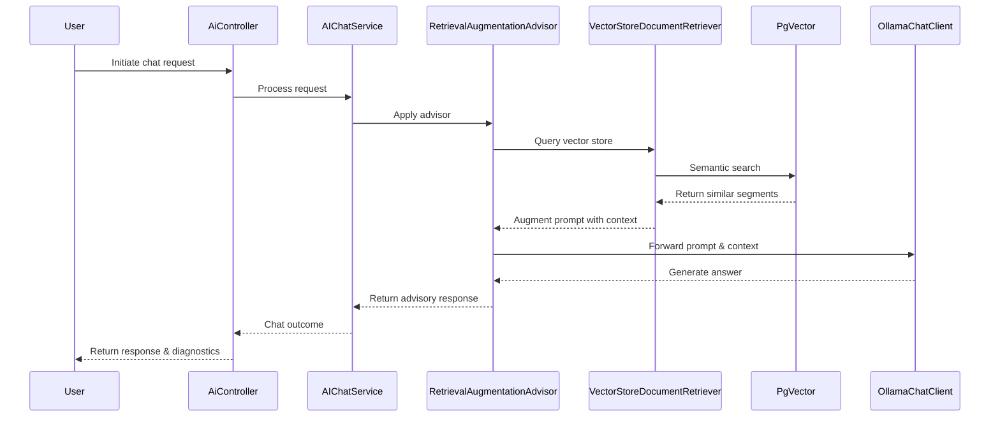

# llm-rag-with-spring-ai-ollama

This project implements a Retrieval-Augmented Generation (RAG) architecture using Spring AI 2.x components, PgVector, and Ollama.

## Architecture & Sequence Flow

```mermaid
sequenceDiagram
    participant User
    participant AiController
    participant AIChatService
    participant RetrievalAugmentationAdvisor
    participant VectorStoreDocumentRetriever
    participant PgVector
    participant OllamaChatClient

    User->>AiController: Initiate chat request
    AiController->>AIChatService: Process request
    AIChatService->>RetrievalAugmentationAdvisor: Apply advisor
    RetrievalAugmentationAdvisor->>VectorStoreDocumentRetriever: Query vector store
    VectorStoreDocumentRetriever->>PgVector: Semantic search
    PgVector-->>VectorStoreDocumentRetriever: Return similar segments
    VectorStoreDocumentRetriever-->>RetrievalAugmentationAdvisor: Augment prompt with context
    RetrievalAugmentationAdvisor->>OllamaChatClient: Forward prompt & context
    OllamaChatClient-->>RetrievalAugmentationAdvisor: Generate answer
    RetrievalAugmentationAdvisor-->>AIChatService: Return advisory response
    AIChatService-->>AiController: Chat outcome
    AiController-->>User: Return response & diagnostics
```

## Configuration

### Document Chunking Strategy
We use `TokenTextSplitter` configured via properties:
- `rag.chunking.size=300`: Sets the maximum chunk size constraints.
- `rag.chunking.minSize=100`: Maintains a minimum chunk size to preserve context boundaries.
Note: While `nomic-embed-text` supports up to 8192 tokens, chunks between 300-500 tokens generally yield the highest quality semantic retrieval.

### Retrieval Configuration
- `rag.retrieval.topK=3`: Retrieves the top 3 contextual segments.
- `rag.retrieval.similarityThreshold=0.6`: Discards segments that do not meet the minimum cosine similarity.

### Observability Setup
This module is fully equipped for production observability using the OTLP/Grafana LGTM stack:
- **Micrometer Metrics:** We record custom timers (`rag.retrieval.latency`, `rag.ingestion.latency`) and counters (`rag.llm.calls`, `rag.documents.retrieved`).
- **Health Indicators:** A custom `PgVectorHealthIndicator` checks vector store connectivity with a 5-second TTL cache to prevent database overload.
- **Diagnostics API:** Append `?includeDiagnostics=true` to any chat request to view the raw retrieved text chunks and their precise vector similarity distance scores.

### Testcontainers Support
This project uses [Testcontainers at development time](https://docs.spring.io/spring-boot/docs/3.2.4/reference/html/features.html#features.testing.testcontainers.at-development-time).
It automatically spins up the required `pgvector/pgvector:pg18` and Ollama containers without manual orchestration.
