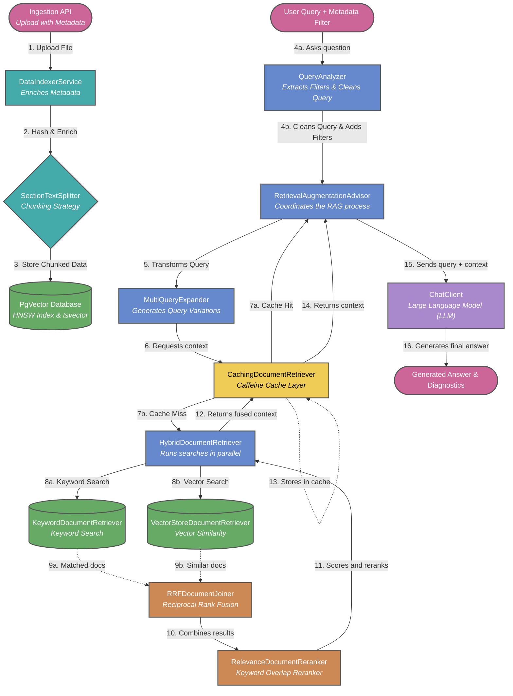

# 🤖 RAG Spring AI Ollama LLM

Welcome to the **RAG (Retrieval-Augmented Generation)** application! This project uses **Spring AI**, **Ollama** (for local LLMs), and **PostgreSQL (pgvector)** to intelligently read your documents and answer questions based on them.

---

## 📑 Table of Contents
1. [Overview](#-overview)
2. [Architecture Flow](#-architecture-flow)
3. [Key Features](#-key-features)
4. [Getting Started](#-getting-started)
5. [API Reference](#-api-reference)
6. [Configuration Reference](#-configuration-reference)
7. [Guardrails](#-guardrails)
8. [Alternative Approaches](#-alternative-approaches)
9. [Performance Tuning](#-performance-tuning)

---

## 🌟 Overview

When you ask a generic AI a specific question about your private data, it often doesn't know the answer. This project solves that by **RAG**. 
1. **Ingestion**: You upload your private documents. The system chops them into bite-sized pieces and saves them in a database.
2. **Retrieval**: When you ask a question, the system searches the database for the most relevant pieces of information.
3. **Generation**: It hands those pieces to the AI (Ollama) and says, "Answer the user's question using *only* this information."

---

## 🏗️ Architecture Flow

Here is how data flows through the system, from uploading a document to receiving an AI-generated answer.


```mermaid
flowchart TD
    %% Define Styles
    classDef userReq fill:#cc6699,stroke:#555555,stroke-width:2px,color:#fff;
    classDef coordinator fill:#6688cc,stroke:#555555,stroke-width:2px,color:#fff;
    classDef searchEngine fill:#66aa66,stroke:#555555,stroke-width:2px,color:#fff;
    classDef fusion fill:#cc8855,stroke:#555555,stroke-width:2px,color:#fff;
    classDef llm fill:#aa88cc,stroke:#555555,stroke-width:2px,color:#fff;
    classDef cache fill:#eecc55,stroke:#555555,stroke-width:2px,color:#000;
    classDef ingestion fill:#44aaaa,stroke:#555555,stroke-width:2px,color:#fff;

    %% Nodes for Ingestion
    IngestApi(["Ingestion API<br/><i>Upload with Metadata</i>"]):::userReq
    DataIndexer["DataIndexerService<br/><i>Enriches Metadata</i>"]:::ingestion
    Splitter{"SectionTextSplitter<br/><i>Chunking Strategy</i>"}:::ingestion
    DB[("PgVector Database<br/><i>HNSW Index & tsvector</i>")]:::searchEngine

    %% Nodes for Retrieval
    User(["User Query + Metadata Filter"]):::userReq
    Analyzer["QueryAnalyzer<br/><i>Extracts Filters & Cleans Query</i>"]:::coordinator
    Advisor["RetrievalAugmentationAdvisor<br/><i>Coordinates the RAG process</i>"]:::coordinator
    MultiQuery["MultiQueryExpander<br/><i>Generates Query Variations</i>"]:::coordinator
    Cache["CachingDocumentRetriever<br/><i>Caffeine Cache Layer</i>"]:::cache
    HybridRetriever["HybridDocumentRetriever<br/><i>Runs searches in parallel</i>"]:::coordinator
    
    KeywordSearch[("KeywordDocumentRetriever<br/><i>Keyword Search</i>")]:::searchEngine
    VectorSearch[("VectorStoreDocumentRetriever<br/><i>Vector Similarity</i>")]:::searchEngine
    
    Joiner["RRFDocumentJoiner<br/><i>Reciprocal Rank Fusion</i>"]:::fusion
    Reranker["RelevanceDocumentReranker<br/><i>Keyword Overlap Reranker</i>"]:::fusion
    
    Ollama["ChatClient<br/><i>Large Language Model (LLM)</i>"]:::llm
    Response(["Generated Answer & Diagnostics"]):::userReq

    %% Ingestion Flow
    IngestApi -->|1. Upload File| DataIndexer
    DataIndexer -->|2. Hash & Enrich| Splitter
    Splitter -->|3. Store Chunked Data| DB
    
    %% Retrieval Flow
    User -->|4a. Asks question| Analyzer
    Analyzer -->|4b. Cleans Query & Adds Filters| Advisor
    Advisor -->|5. Transforms Query| MultiQuery
    MultiQuery -->|6. Requests context| Cache
    
    Cache -- 7a. Cache Hit --> Advisor
    Cache -->|7b. Cache Miss| HybridRetriever
    
    HybridRetriever -->|8a. Keyword Search| KeywordSearch
    HybridRetriever -->|8b. Vector Search| VectorSearch
    
    KeywordSearch -.->|9a. Matched docs| Joiner
    VectorSearch -.->|9b. Similar docs| Joiner
    
    Joiner -->|10. Combines results| Reranker
    Reranker -->|11. Scores and reranks| HybridRetriever
    HybridRetriever -->|12. Returns fused context| Cache
    Cache -.->|13. Stores in cache| Cache
    Cache -->|14. Returns context| Advisor
    
    Advisor -->|15. Sends query + context| Ollama
    Ollama -->|16. Generates final answer| Response
```

---

## ✨ Key Features

1. **Hybrid Search**: ON. Combines two types of search: Vector Search (meaning) and Keyword Search (exact words).
2. **Multi-Stage Retrieval (Reranking)**: ON. The system grabs a bunch of relevant documents, then double-checks and re-scores them via Keyword-overlap reranking.
3. **Caching Layer**: ON. Retrieves cached context for identical queries, skipping heavy database searches.
4. **HNSW Indexing**: ON. Uses a highly optimized indexing algorithm in PostgreSQL.
5. **Section-Aware Chunking**: Available but token-based chunking is the default. Intelligently splits your documents.
6. **Metadata Filtering**: ON. You can tag uploaded documents and search strictly within those categories.
7. **Self-Querying**: ON. Automatically analyzes user questions to extract metadata filters (like year, category, document type) before searching.
8. **Guardrails**: ON. Intercepts queries on restricted topics (politics, violence, etc.) and halts the request gracefully.

---

## 🚀 Getting Started

### Prerequisites
- Java 25+
- Docker (for Testcontainers)
- No manual database setup needed

### Running Locally
```bash
./mvnw spring-boot:run
```
Testcontainers automatically spins up PostgreSQL (pgvector) and Ollama.

### Running Tests
```bash
./mvnw verify
```

---

## 📡 API Reference

### Upload Document
```bash
curl -X POST -F "file=@manual.pdf" \
  "http://localhost:8080/api/data/v1/upload?documentType=manual&owner=support&category=hardware"
```
Supported formats: `.pdf`, `.txt`, `.json`

### Chat
```bash
curl -X POST http://localhost:8080/api/ai/chat \
  -H "Content-Type: application/json" \
  -d '{"question": "How to reboot?", "documentType": "manual", "category": "hardware"}'
```

### Chat with Diagnostics
```bash
curl -X POST "http://localhost:8080/api/ai/chat?includeDiagnostics=true" \
  -H "Content-Type: application/json" \
  -d '{"question": "How to reboot?"}'
```

### Clear Cache
```bash
curl -X DELETE http://localhost:8080/api/data/v1/cache
```

### Document Count
```bash
curl http://localhost:8080/api/data/v1/count
```

---

## ⚙️ Configuration Reference

All properties are configured in `application.properties` using `@ConfigurationProperties` binding.

### Retrieval Pipeline (`rag.retrieval.*`)

| Property                             | Default  | Description                                          |
|--------------------------------------|----------|------------------------------------------------------|
| `rag.retrieval.mode`                 | `hybrid` | Retrieval strategy: `vector`, `keyword`, or `hybrid` |
| `rag.retrieval.top-k`                | `3`      | Number of documents for vector search                |
| `rag.retrieval.similarity-threshold` | `0.6`    | Minimum cosine similarity for vector results         |
| `rag.retrieval.keyword.top-k`        | `3`      | Number of documents for keyword search               |
| `rag.retrieval.rrf.k`                | `60`     | RRF constant (higher = more uniform weighting)       |
| `rag.retrieval.hybrid.top-k`         | `3`      | Final result count after fusion                      |
| `rag.retrieval.rerank.enabled`       | `true`   | Enable keyword-overlap reranking                     |
| `rag.retrieval.rerank.top-k`         | `3`      | Documents to keep after reranking                    |

### Chunking (`rag.chunking.*`)

| Property                       | Default               | Description                                          |
|--------------------------------|-----------------------|------------------------------------------------------|
| `rag.chunking.strategy`        | `token`               | `token` or `section`                                 |
| `rag.chunking.size`            | `300`                 | Max chunk size in tokens                             |
| `rag.chunking.min-size`        | `100`                 | Min chunk size in characters                         |
| `rag.chunking.section.pattern` | `(^#+\s+.*$)\|(\n\n)` | Regex for section boundaries (when strategy=section) |

### Cache (`rag.cache.*`)

| Property                | Default | Description                     |
|-------------------------|---------|---------------------------------|
| `rag.cache.enabled`     | `true`  | Enable Caffeine retrieval cache |
| `rag.cache.ttl-seconds` | `3600`  | Cache entry time-to-live        |
| `rag.cache.max-size`    | `1000`  | Maximum cache entries           |

### Query Transformation (`rag.query.*`)

| Property                          | Default | Description                                                 |
|-----------------------------------|---------|-------------------------------------------------------------|
| `rag.query.multiquery.enabled`    | `false` | Enable Multi-Query generation via LLM                       |
| `rag.query.multiquery.variations` | `3`     | Number of variations to generate                            |
| `rag.query.self-querying-enabled` | `false` | Enable Self-Querying / QueryAnalyzer feature                |
| `rag.query.model`                 | `null`  | Optional override for the LLM used in query transformations |

### Guardrails (`guardrails.*`)

| Property                     | Default                 | Description                    |
|------------------------------|-------------------------|--------------------------------|
| `guardrails.sensitive-words` | `politics,religion,...` | Comma-separated blocked words  |
| `guardrails.failure-message` | `I'm sorry, but I...`   | Response when query is blocked |
| `guardrails.logging.enabled` | `true`                  | Enable prompt/response logging |

### Observability

| Property                                    | Default                          | Description                |
|---------------------------------------------|----------------------------------|----------------------------|
| `management.endpoints.web.exposure.include` | `health,info,metrics,prometheus` | Exposed actuator endpoints |
| `management.tracing.sampling.probability`   | `1.0`                            | Trace sampling rate        |

---

## 🛡️ Guardrails

| Feature                   | Implemented | Description                                                                   |
|---------------------------|-------------|-------------------------------------------------------------------------------|
| Input Validation          | Yes         | Rejects empty, overly long, or malformed queries.                             |
| Sensitive Topic Filtering | Yes         | Blocks queries containing defined restricted words (e.g. politics, violence). |
| PII Redaction             | No          | Does not yet detect or strip Personally Identifiable Information from inputs. |
| Output Content Filtering  | No          | Does not review the LLM's response for safety violations.                     |

---

## 🧠 Alternative Approaches

1. **SQL-Level Hybrid Fusion:** Write a single, complex PostgreSQL query that calculates both vector distance and keyword text-match score. Great for pagination, but harder to tune.
2. **LLM-Based Re-ranking:** Pass all candidate documents back into an AI (Cross-Encoder) to accurately score relevance. Extremely accurate but very slow and computationally expensive.
3. **External Re-ranking Services:** Use an API like Cohere Rerank. Very fast and accurate, but introduces a dependency on an external vendor.
4. **Pure BM25 / Keyword-Only Retrieval:** Rely entirely on traditional text search. Extremely fast, but cannot understand synonyms or the "meaning" of a query.

---

## 🔧 Performance Tuning

1. **HNSW:** Increase `m` (default 24) and `ef_construction` (default 128) for better recall at the cost of RAM and build time.
2. **Caching:** Lower `rag.cache.ttl-seconds` for frequently changing data. Cache is auto-cleared on document upload only when the ingestion process completes (the controller clears the cache based on ingestion status).
3. **Monitoring:** Track `rag.cache.hits`/`misses`, `rag.rerank.latency`, `rag.llm.calls` via `/actuator/metrics`.
