# Getting Started

This module provides a foundational Retrieval-Augmented Generation (RAG) implementation using Spring AI and OpenAI. Compared to the more complex hybrid retrieval module, this represents a simpler, standard RAG architecture utilizing a single semantic vector search against a pgvector store.

## Architecture

```mermaid
flowchart TD
    %% Define Styles / Legend
    classDef userReq fill:#cc6699,stroke:#555555,stroke-width:2px;
    classDef coordinator fill:#6688cc,stroke:#555555,stroke-width:2px;
    classDef searchEngine fill:#66aa66,stroke:#555555,stroke-width:2px;
    classDef processing fill:#cc8855,stroke:#555555,stroke-width:2px;
    classDef llm fill:#aa88cc,stroke:#555555,stroke-width:2px;

    subgraph Startup Flow
        Docx(["Document (.docx)"]):::userReq
        Reader["TikaDocumentReader"]:::coordinator
        Splitter["TokenTextSplitter"]:::processing
        AddStore[("VectorStore<br/>(pgvector)")]:::searchEngine
        
        Docx --> Reader
        Reader --> Splitter
        Splitter --> AddStore
    end

    subgraph Query Flow
        Endpoint(["POST /api/ai/chat"]):::userReq
        Service["AIChatService"]:::coordinator
        SearchStore[("VectorStore.similaritySearch()")]:::searchEngine
        Prompt["SystemPromptTemplate<br/>(+ context)"]:::processing
        Client["ChatClient"]:::llm
        OpenAI["OpenAI"]:::llm
        Response(["Response"]):::userReq
        
        Endpoint --> Service
        Service --> SearchStore
        SearchStore -.->|Context| Prompt
        Service --> Prompt
        Prompt --> Client
        Client --> OpenAI
        OpenAI --> Response
    end
```

### Testcontainers support

This project uses [Testcontainers at development time](https://docs.spring.io/spring-boot/docs/3.2.4/reference/html/features.html#features.testing.testcontainers.at-development-time).

Testcontainers has been configured to use the following Docker images:

* [`pgvector/pgvector:pg18`](https://hub.docker.com/r/pgvector/pgvector)

Please review the tags of the used images and set them to the same as you're running in production.
